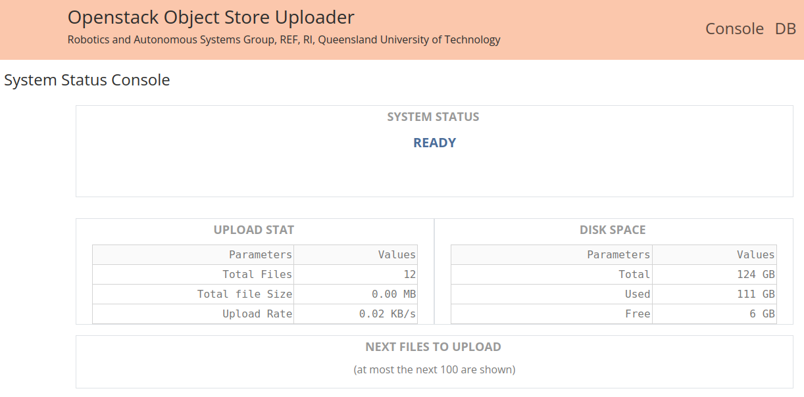
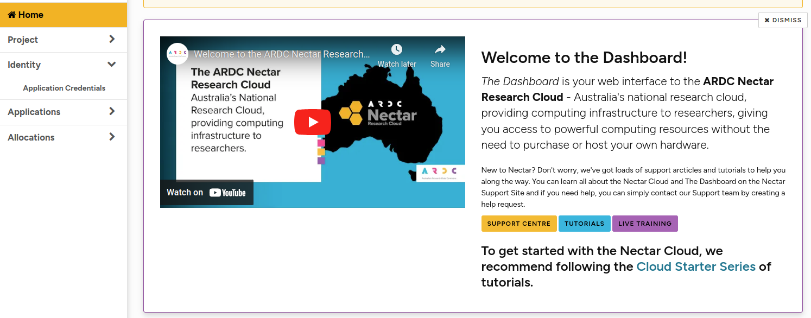

# OpenStack Object Store File Uploader

 [](https://www.gnu.org/licenses/gpl-3.0)

**Robotics and Autonomous Systems Group, Research Engineering Facility, Research Infrastructure** 
**Queensland University of Technology**

## Introduction

The openstack object store file uploader is a ROS 1 (noetic) application node that performs an one-way sync to send files to an openstack compliant object store. This application node can support the [bagfiles capturer](https://github.com/REF-RAS/bagfiles_capturer). It is designed to operate autonomously and remotely. The one-way sync is a useful feature if file downloading is not required.

The application can operate in web-based mode or headless mode. The web-based mode offers basic monitoring information about the application, such as the files in the upload queue and upload statistics. In the headless mode, the web interface is not available and the application operates in a silent mode.

## Software Requirements and Installation Guide

This application is a package based on ROS 1 (noetic) and Python 3.8 (or above). It uses a number of third party Python modules as specified in `requirements.txt`.

### Step-by-step Installation
1. Create a catkin workspace or use an existing one.
```
mkdir -p ~/catkin_ws/src
cd ~/catkin_ws/src
```
2. Clone this repository under the `src` directory.
```
git clone git@github.com:REF-RAS/openstack_object_uploader.git
```
3. Build this package.
```
rosdep install --from-paths src --ignore-src -r -y --rosdistro noetic
source /opt/ros/noetic/setup.bash
catkin_make -DPYTHON_EXECUTABLE=/usr/bin/python3
```
4. Obtain an application credential file `clouds.yaml` from a openstack compliant cloud service, such as the ARDC Nectar Research Cloud (https://ardc.edu.au/services/ardc-nectar-research-cloud/). The credential file should contain the pair of application_id and application_secret, and the details of the cloud service. 

See the section below for getting the credential file from the Nectar Cloud.

5. If you have already got a valid and current credential file. Move it to the folder `~\.config\openstack`.
```
cd <the path of the clouds.yaml>
mkdir -p ~/.config/openstack
mv clouds.yaml ~/.config/openstack
```

6. Start the uploader application. The application should start even though some of the configuration parameters need changing.
```
cd ~/catkin_ws
source devel/setup.bash
rosrun openstack_object_uploader run.py
```
7. Test the application using a web browser.
A web interface is provided if the mode is `web`. Point the web browser to `http://0.0.0.0:8071`, which is the default URL for the web interface. The following web interface should appear.



## Create an Application Credential on Nectar and Download the clouds.yaml File

If your institution is in Australia or New Zealand and a partner of the ARDC Nectar Research Cloud, then you can login to the site using your institution authentication (https://dashboard.rc.nectar.org.au/dashboard_home/).



The dashboard offers many functionalties that are not described here. Basically, the basic account starts with a trial project, which offers a basic storage capacity. You can apply for a real project if you need more.  Based on the trial project, you can still create an application credential. Follow the tutorial by visiting the following link.

https://tutorials.rc.nectar.org.au/application-credentials/01-overview

At the end, you will be given the opportunity to download the clouds.yaml file. Please download that file and then move it to the directory `~/.config/openstack`.


## The Configuration yaml File

The configuration file `config/uploader_config.yaml` must be edited so that the application can run properly. The following goes through every parameter.

```yaml
uploader.mode: web   # web or headless
```
Determines whether the uploader provides a web interface (`web`) or no interface (`headless`). Other values will cause an error.
```yaml
# cloud name, as appeared in the clouds.yaml file
uploader.filestore.cloud: openstack
# filestore path
uploader.filestore.local: /home/qcr/Bagfiles
uploader.filestore.cloud.container: Bagfiles
```
The cloud name specified in the `clouds.yaml` should be set against `uploader.filestore.cloud`. If Nectar or another openstack compliant cloud service is used, then the `clouds.yaml` should normally use `openstack`. The name is found under `clouds` in the yaml file.
```yaml
...
clouds:
  openstack:
   ...
```

The `uploader.filestore.local` specifies the local directory where new files are to be detected and uploaded. Note that the uploader is only interested in _new_ files. However, touching the files can force the uploader to consider them as new files.

The `uploader.filestore.cloud.container` specifies the container name in the object store where the files are uploaded. If the container does not exist, the uploader will create it.

```yaml
uploader.web.host: 0.0.0.0
uploader.web.port: 8071
uploader.web.launch_browser: False  # whether to launch the web browser when the application starts
```
Determines the host IP and the port number of the web interface. Changing from `False` to `True` for `uploader.web.launch_browser` tells the application to launch the web browser and point it at the given host IP and port number.

```yaml
uploader.delay: 30 # seconds
uploader.error_count.max: 5  
```
The uploader autonomously detect new or modified files. It waits for a period of time before uploading the file to allow the file writer to finish writing. 

Failures to upload file will be retried up to a maximum error count, as specified in `uploader.error_count.max`. 

## The Commands

The following command will launch the google drive file uploader in the mode specified in the configuration file.
```bash
roslaunch openstack_object_uploader upload.launch
```
The mode can be specified in the command as follows, which will override the one in the configuration file. 
```bash
roslaunch openstack_object_uploader upload.launch mode:=headless
```
The database can be reset from the command line. Use the following command to drop all database tables and re-create them.
```bash
rosrun openstack_object_uploader reset_database.py
```

### Working with Bagfiles Capturer

The [bagfiles capturer](https://github.com/REF-RAS/bagfiles_capturer) provides a launch file for bringing up the capturer only.

```bash
roslaunch bagfiles_capturer capture.launch
```

## Developer

Dr Andrew Lui, Senior Research Engineer <br />
Robotics and Autonomous Systems, Research Engineering Facility <br />
Research Infrastructure <br />
Queensland University of Technology <br />

## Acknowledgement

The developer is grateful to Timothy Morris, Senior Research Engineer, for sharing his useful knowledge on ARDC Nectar Research Cloud.

Latest update: Jun 2024